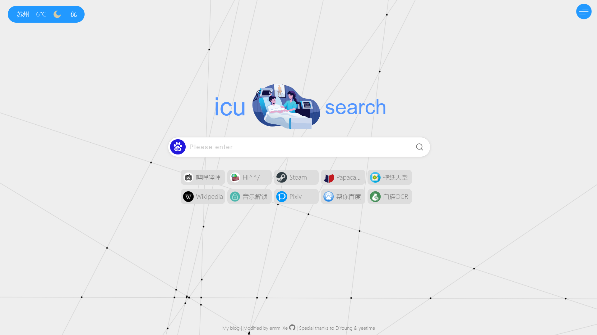
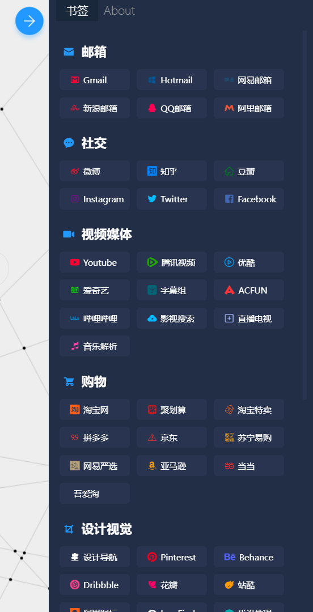
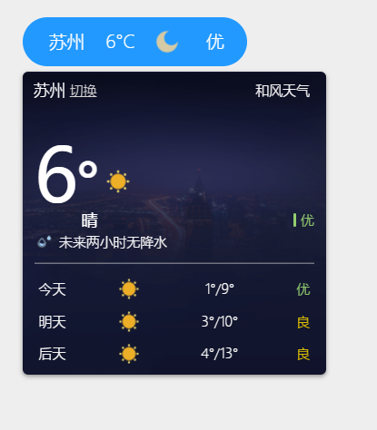
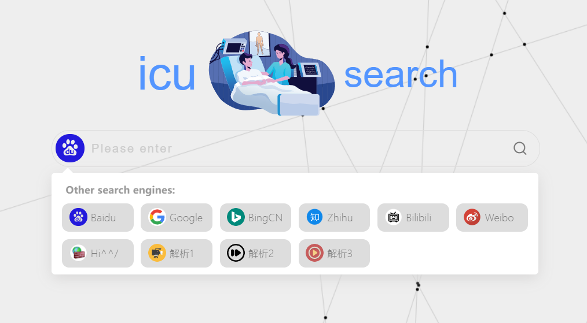

+++
author = "我无IQ"
title = "介绍一下我的导航网站"
date = "2021-12-01"
description = "自建导航网站的介绍"
tags = [
    "我的网站"
]
categories = [
    "分享"
]
image = "wallhaven-49yj1n.jpg"
+++

网址: [sou.lifein.icu](https://sou.lifein.icu)
 

在搭建这个博客之前我还搭建过一个导航网站，网站的源码结合了这 github 上的这两个项目 [sou2](https://github.com/yeetime/sou2) & [sou](https://github.com/5iux/sou) 。

 
 

博客&网站都部署在 Vercel 上，速度一般吧，不过胜在稳定和国内可以直接访问。
 

## 具体功能

- 可以按下搜索引擎的图标来切换不同的搜索引擎
- 左上角会显示天气，鼠标悬浮在上面可以显示详细信息
- 右上角有个按钮可以开启/关闭侧栏，侧栏里是一些网址导航
   
